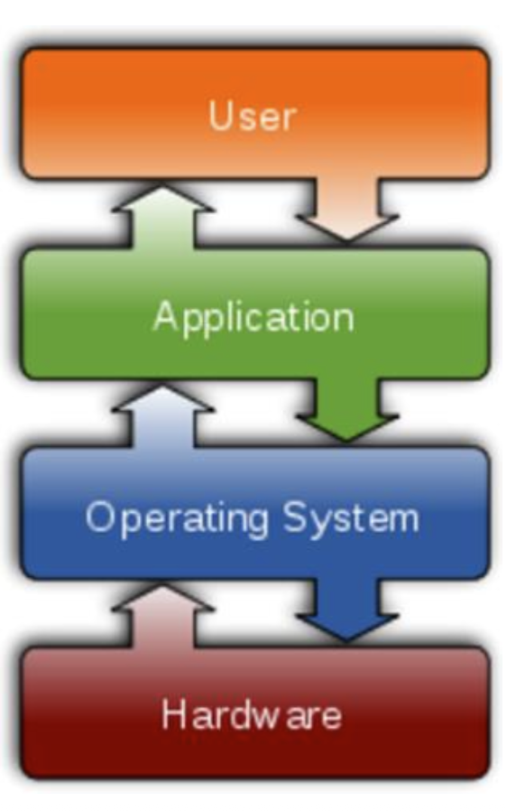
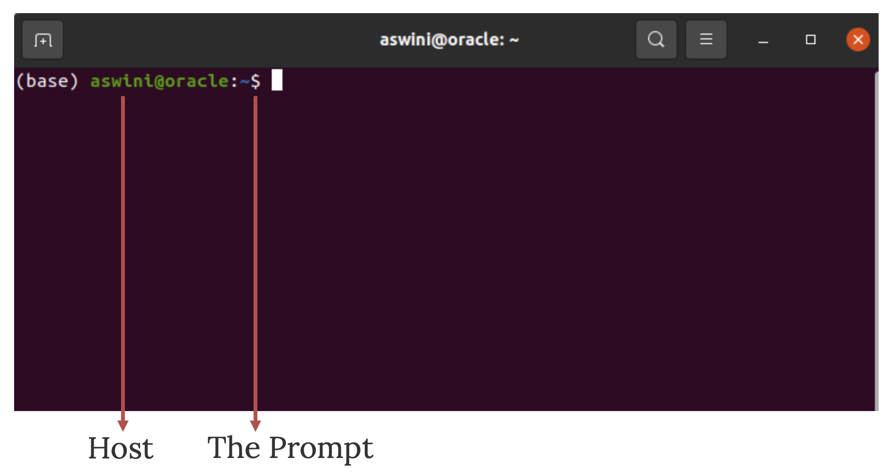

## What is an Operating System (OS) ?

An operating system is a set of software programs that controls the computer and enables it to function effectively. It manages the computer’s hardware and software resources, coordinates system activities, and ensures that different programs run smoothly. Acting as an interface between the hardware and the user, the operating system allows users to interact with the computer in a simple and efficient way.

{width="161"}

## What is Linux

Linux is a standard operating system, similar to Windows or macOS, that allows users to interact with and manage a computer. It is an open-source, Unix-like system, meaning its source code is freely available for anyone to use, modify, and distribute. Due to its open nature, there are currently over 600 different Linux distributions, each tailored to specific needs and use cases.

{width="573"}

A Linux system is made up of several key components that work together to operate the computer:

-   The hardware includes all physical devices such as the CPU, RAM, and storage drives.

-   The kernel is the core of the operating system, interacting directly with the hardware and managing essential system operations.

-   System libraries provide special functions that allow programs to access kernel features without needing direct interaction with the hardware.

-   Finally, system utilities perform specialized tasks and provide users with most of the practical functionalities of the operating system, enabling everyday system management and use.

The **UNIX** operating system was developed in the late 1960s.

-   It originally began as a one-man project led by Ken Thompson of Bell Labs and has since grown to become the most widely used operating system.

-   In the time since UNIX was first developed, it has gone through many different generations and versions.

-   An interesting and rather up-to-date timeline of these variations of UNIX can be found at:

    <https://www.computerhope.com/history/unix.htm>

{width="407"}

*Ken Thompson (sitting) and Dennis Ritchie, the fathers of Unix. PDP-11 mini computer on which the first edition of Unix (Credit: Sheila Gibbon/lexleader.net)*

Linus Benedict Torvalds began developing Linux as a hobby while he was a student at the University of Helsinki, aiming to create a system similar to UNIX. In 1991, at just 21 years old, he released the source code for Linux 0.0.1 to the public, introducing a freely available Unix-like operating system kernel. This marked the beginning of Linux, a project that would go on to transform the history of UNIX and the broader world of computing forever.

## Why use Linux?

Linux is widely used because it is open-source, secure, and highly reliable. It offers strong performance and regular software updates, making it suitable for both personal and professional use. In fields such as bioinformatics, many tools are developed specifically for Linux, increasing its practicality for research. With hundreds of distributions available and support from a large global community, Linux provides flexibility, stability, and continuous improvement.

## Shell

The terms“**terminal**”, **“shell”** and“**command line interface**” are often used interchangeably, but there are subtle differences between them:

-   **A terminal** is an input and output environment that presents a text-only window running a shell.

-   **A shell** is a command line interpreter, used to launch software in Linux.

-   **A command line interface** is a user interface (managed by a command line interpreter program) that processes commands to a computer program and outputs the results.

{width="612"}

## Working with the Terminal

The terminal interprets commands the user types and manages their execution. Commands are case sensitive.

## Understanding Linux File System

The Linux file system is organized as a hierarchical structure of directories (folders) arranged in a tree-like format. Each directory can contain files as well as other subdirectories. Unlike some operating systems, drives in Linux do not appear as separate root locations but are mounted at specific points within the file system, allowing them to integrate seamlessly into the overall directory structure. {width="506"}

*A illustration of the Linux File System*

## Specifying File Paths

When working in a Unix or Linux file system, there are different ways to specify the location of a file.

An **absolute path** starts from the root of the file system (shown as `/`) and provides the full path to the file, such as `/home/username/Documents/Data/some_file.txt`. This path will always point to the same file, no matter which directory you are currently in.

A **relative path** is defined from your current working directory. For example, if you are already in `/home/username/Documents/`, you can refer to the same file simply as `Data/some_file.txt`.

Finally, the tilde symbol (`~`) is a shortcut that represents your home directory (e.g., `/home/username/`), so `~/Documents/Data/some_file.txt` is another way to write the full path without typing the entire home directory name.
